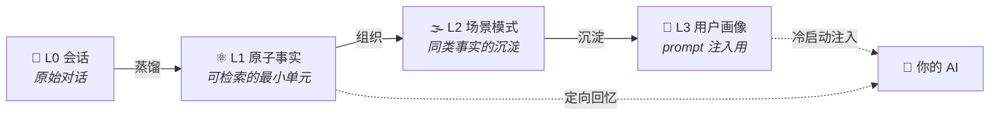

<div align="center">

# 🧠 Engram

### 把 AI 的记忆，做成可蒸馏、可检索、可审计、可遗忘的资产

**单用户 AI 长期记忆平台 · Rust 单二进制 · 五域 MCP · 全程可溯源**

[](server/)
[](web/)
[](server/crates/storage/)
[](#-mcp-五域工具面)
[](#-门禁)
[](LICENSE)

> **en·gram**（/ˈenɡræm/）*n.* 神经科学中的「记忆痕迹」——记忆在脑中留下的物理印记。
>
> **AI 的记忆，不该随会话蒸发。**

</div>

---

## 💥 为什么需要它

大模型的记忆活在一个会话里：关掉窗口，用户是谁、项目推进到哪、上次踩过什么坑——全部清零。
给模型塞一个「记事本」解决不了问题，因为**记忆的质量取决于记忆的治理**：

- 塞进去的东西可信吗？——**每一层都要能回放它从哪来、怎么来的**
- 记错了怎么办？——**纠错走取代链，而不是覆盖**
- 不想让它记的，真忘得掉吗？——**遗忘是一等公民，不是 UPDATE 语句**

Engram 是一个「平台即工具」：平台对外暴露 HTTP API，AI（或人）拿着 API key 操纵；
人通过 Web 控制台治理浏览。核心理念一句话——

> ## 信任源于可溯源 🔍

## 🪜 记忆蒸馏阶梯

对话原文不是记忆，记忆是被蒸馏出来的。Engram 把「一句闲聊」变成四层可治理的资产：



- **全程可溯源**：蒸馏链每层记录 `prompt_version`，任意记忆可归因回放到产出它的那一版 prompt
- **纠错走蒸馏**：把正确的表述写成对话，蒸馏自动生成取代链——永不直接改写语义内容
- **遗忘是断层**：`memory_forget`（void）会话作废，已蒸馏产物**级联归档**，检索立即失效
- **实体坐标系**：人物 / 项目 / 主题 / 群组 / 地点，由蒸馏自动抽取，横向串联所有记忆

## 🗂️ 五域资产

| 域 | 记什么 | 形态 |
|:--|:--|:--|
| 💬 **Chat Memory** | 用户的事实、偏好、决策、事件 | L0→L3 分层蒸馏，全程可溯源 |
| 🕸️ **Wiki** | 世界的知识：文档 + LLM 增量互链 | 文档/URL 摄取 → `[[wikilink]]` 知识网 + 图谱 + lint 死链分级 |
| 🧬 **CodeGraph** | 代码库结构索引 | 本地路径/git 注册 → CLI 异步索引 → 六种结构化查询 + 调用子图 / 文件依赖全图 |
| 🧩 **项目记忆** | 跨会话的工作「线」 | 项目 + 多主机位置 + 分类文档，精确寻址读（零截断） |
| 🪄 **Skills** | 可复用的 AI 技能包（文件夹：SKILL.md + scripts/references） | slug 唯一 + 容错导入 + 版本快照回滚 + 附属文件按路径寻址 + 三层取用 |

## 🛡️ 治理，不是摆设

| | 能力 | 一句话 |
|:--|:--|:--|
| 🔒 | **敏感标记** | 医疗/感情/财务对话一个开关，检索/打包/导出默认排除 |
| ⚖️ | **编辑分权** | AI 只写会话；改写语义内容是用户专属，改动留痕钉住 |
| 🧹 | **一等清空** | deep purge 两阶段（arm 5 分钟冷却 → token 执行），agent 级彻底清场 |
| 🧾 | **数据主权** | 全系统一键导出/导入 + 远程拉取迁移（A→B）；密钥 AES-GCM 加密落库 |
| 🚦 | **任务队列** | 一切长操作走 PG 队列（蒸馏/摄取/索引/同步），pending/running/dead 生命周期可见可恢复 |

## 🏗️ 技术形态

```text
                    ┌─────────────────────────────┐
   AI 客户端 ──MCP──▶│                             │
                    │   engram-server（Rust 单二进制）│
   浏览器 ────HTTP──▶│   axum + sqlx + rust-embed   │
                    └──────────────┬──────────────┘
                                   │
                    ┌──────────────▼──────────────┐
                    │  PostgreSQL 17 + pgvector    │
                    │  FTS(jieba) + ANN + RRF 混合  │
                    │  任务队列 · 审计链 · 版本快照   │
                    └─────────────────────────────┘
```

- **后端**：Rust workspace 11 crates（`engram-api` / `engram-mcp` / `engram-core` / `engram-storage` / `engram-wiki-engine` / …）；领域表业务面 SQL 唯一收口在 `engram-storage::repo` 仓储层
- **前端**：React 19 + TypeScript + Vite 8 + Tailwind 4，十页 SPA，墨白双主题（Vercel/Geist 系设计语言）
- **单二进制单端口**：一个 `engram-server` 同源托管 API + SPA + MCP，本地/Docker 单机部署
- **中文友好**：jieba FTS + 向量混合检索（RRF 融合），零匹配时收紧向量阈值——返回空，不返回噪声

## 🔌 MCP 五域工具面

engram-server 内置 MCP 服务端（官方 Rust SDK `rmcp`，Streamable HTTP）。
**一个 `/mcp` 端点，五个域 45 个工具**，按 key 的 scope 分权——AI 看到的工具面与它实际能调用的完全一致：

| 域 | scope | 工具 |
|:--|:--|:--|
| 💬 用户记忆 | `memory` | `memory_context`（冷启动上下文包）· `search` · `list_atoms` · `list_sessions` · `get_session` · `write_session` · `append_session` · `forget` · `entities` |
| 🧩 项目记忆 | `project` | `project_list/get/create/update/delete/…` · `location_*` · `doc_add/get/search/update/delete`（共 15） |
| 🪄 技能 | `skills` | `skills_list/get/create/update/delete/import` + `skills_file_get/put`（附属文件按路径读写，脚本由客户端本地执行） |
| 🕸️ Wiki | `wiki` | `wiki_search`（混合检索+purpose）· `list_pages` · `get_page` · `write_page` · `ingest` · `archive_query` · `graph` · `lint` |
| 🗺️ 代码图谱 | `codegraph` | `codegraph_list`（动态项目清单）· `register` · `index` · `sync`（三者走任务队列）· `query`（search/explore/node/callers/callees/impact） |

控制台「MCP」页 = 服务总开关（关闭即整体 503）+ 逐域逐工具开关（停用即对 AI 隐身 + 调用拒绝）；
MCP 专用密钥在「设置 → API 密钥」签发，scope 选择器按需勾选。

Claude Code 三秒接入：

```bash
claude mcp add --transport http engram http://localhost:8080/mcp \
  --header "Authorization: Bearer amk_你的密钥"
```

> 🛡️ 远程部署需放开 Host 白名单：`AGENT_MEMORY_MCP_ALLOWED_HOSTS=mem.example.com`（默认仅 loopback，防 DNS rebinding）。

## 🚀 快速上手

### Docker（推荐）

```bash
git clone https://github.com/trtyr/engram && cd engram/deploy
docker compose up
# 控制台 → http://localhost:8080（管理员密码见 .env）
```

### 本地开发

```bash
# 后端（需 PostgreSQL 17 + pgvector）
cd server
AGENT_MEMORY_DATABASE_URL=postgres://127.0.0.1:5432/engram \
AGENT_MEMORY_ADMIN_PASSWORD=admin123 \
AGENT_MEMORY_MASTER_KEY=$(python3 -c "print('ab'*32)") \
  cargo run --bin engram-server

# 前端（dev server，Vite 代理到 8080）
cd web && pnpm install && pnpm dev
```

## 📖 文档

三层档案，各管一层视角：

| 层 | 入口 | 看什么 |
|:--|:--|:--|
| 🌐 全栈 | [docs/](docs/README.md) | 仓库整体、前后端接缝、跨栈约定 |
| ⚙️ 后端 | [server/docs/](server/docs/README.md) | Rust workspace 完整档案 |
| 🎨 前端 | [web/docs/](web/docs/README.md) | Engram SPA 完整档案 |

- 📐 产品事实与设计系统：[PRODUCT.md](PRODUCT.md) · [DESIGN.md](DESIGN.md)
- 🧭 接手第一步读 [docs/current-state.md](docs/current-state.md)

## 🔁 数据迁移

```bash
# A 机导出迁移包（手动方式：文件拷到 B 机导入）
curl -H "Authorization: Bearer $ADMIN" http://a-host:8080/migrate/export -o transfer.json
# B 机导入（冲突跳过，合并语义可重复执行）
curl -X POST -H "Authorization: Bearer $ADMIN_B" -H "Content-Type: application/json"   --data-binary @transfer.json http://b-host:8080/migrate/import
# 或 B 机一键远程拉取（认证：A 机管理员密码，仅请求期使用不落库）
curl -X POST -H "Authorization: Bearer $ADMIN_B" -H "Content-Type: application/json"   -d '{"source_url":"http://a-host:8080","source_admin_password":"…"}' http://b-host:8080/migrate/pull
```

覆盖五域全部业务数据（用户记忆五表 + 实体关系 / 技能含附属文件 / Wiki 页面 / 项目记忆）；
向量与 codegraph 索引为派生数据不迁移，导入端重建。控制台「设置 → 数据迁移」有同能力 UI。

## ✅ 门禁

```bash
cd server && cargo fmt --check && cargo clippy --workspace --all-targets -- -D warnings && cargo test --workspace
cd web && pnpm run lint && pnpm exec tsc --noEmit && pnpm test && pnpm run build
```

---

<div align="center">

**Engram** —— 记忆，不该蒸发。🧠

<sub>MIT License · Built with Rust + React + PostgreSQL</sub>

</div>
