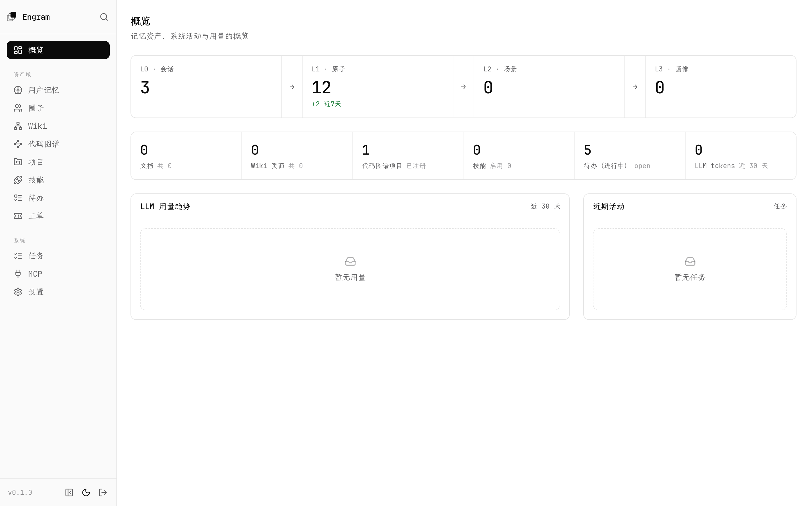
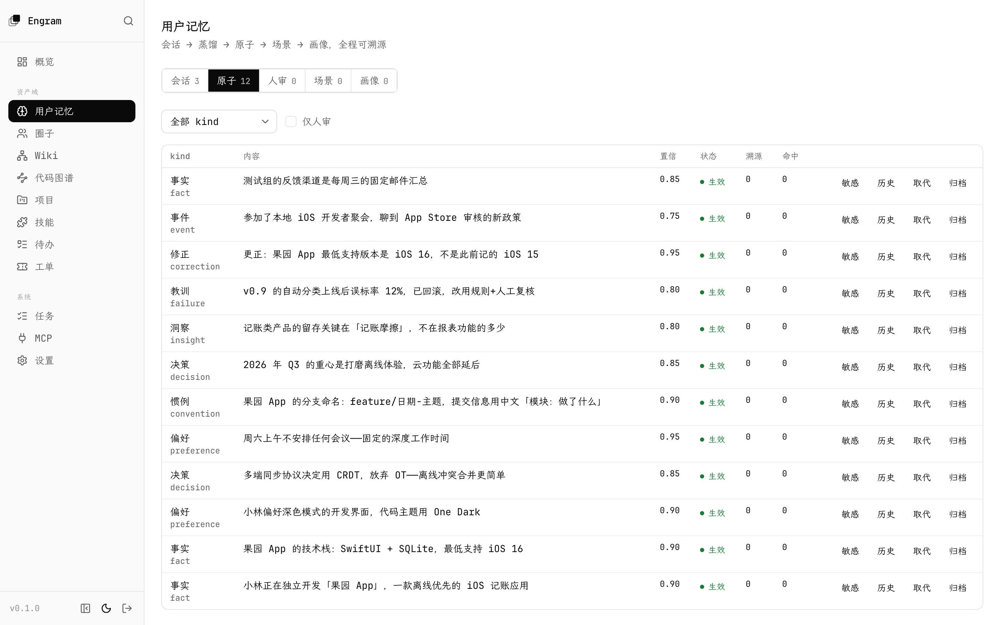
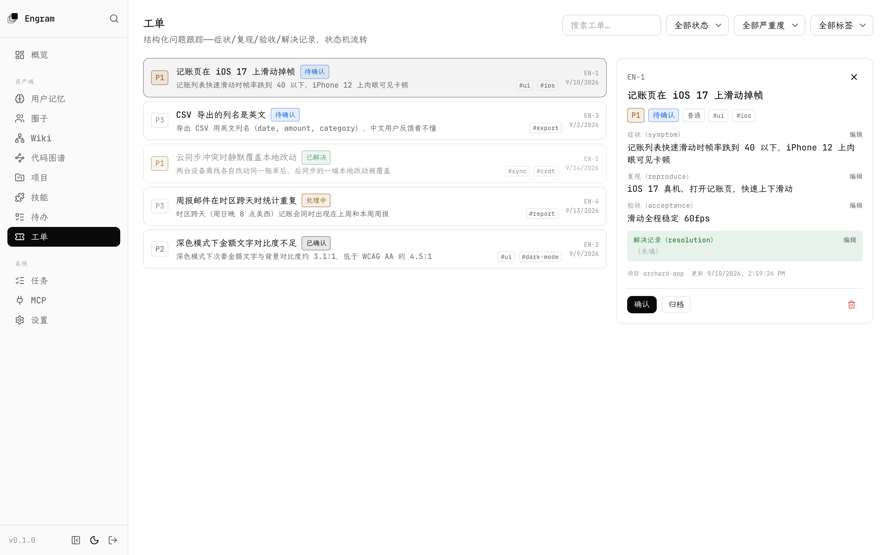
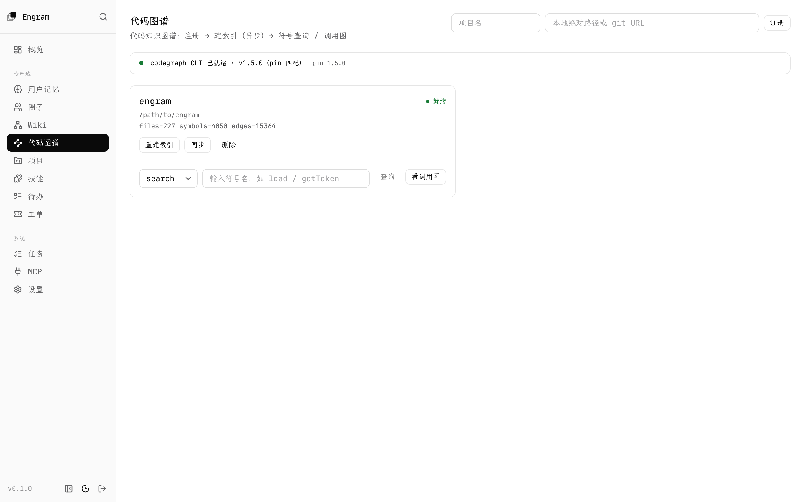
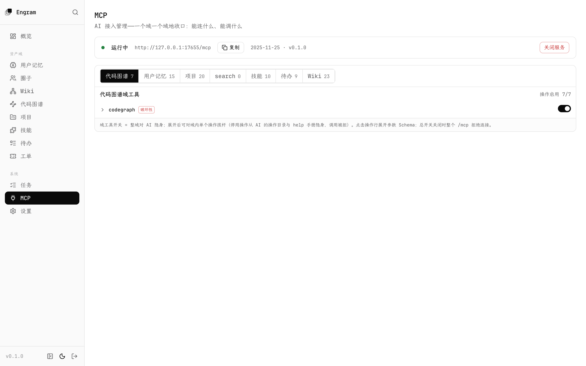
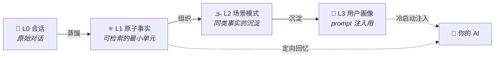

<div align="center">

# 🧠 Engram

### 把 AI 的记忆，做成可蒸馏、可检索、可审计、可遗忘的资产

**单用户 AI 长期记忆平台 · Rust 单二进制 · 九域 MCP 渐进式发现 · Wiki 单库 · 全程可溯源**

[](server/)
[](web/)
[](server/crates/storage/)
[](#-mcp给-ai-的原生接口)
[](LICENSE)

> **en·gram**（/ˈenɡræm/）*n.* 神经科学中的「记忆痕迹」——记忆在脑中留下的物理印记。
>
> **AI 的记忆，不该随会话蒸发。**

</div>

---

## 💥 它解决什么问题

大模型的记忆活在一个会话里：关掉窗口，用户是谁、项目推进到哪、上次踩过什么坑——全部清零。
给模型塞一个「记事本」解决不了问题，因为**记忆的质量取决于记忆的治理**：

- 塞进去的东西可信吗？——**每一层都要能回放它从哪来、怎么来的**
- 记错了怎么办？——**纠错走取代链，而不是覆盖**
- 不想让它记的，真忘得掉吗？——**遗忘是一等公民，不是 UPDATE 语句**

Engram 是一个「平台即工具」：平台对外暴露 MCP 与 HTTP API，AI（或人）拿着密钥操纵；
人通过 Web 控制台治理浏览。核心理念一句话——

> ## 信任源于可溯源 🔍

## 🖼️ 界面一览

**概览**——记忆管线四层（会话 → 原子 → 场景 → 画像）一目了然：



| 用户记忆 | 工单 |
|:---:|:---:|
|  |  |
| **代码图谱** | **MCP 工具面** |
|  |  |

> 截图为演示数据（虚构人物与项目）。

## 🪜 记忆蒸馏阶梯

对话原文不是记忆，记忆是被蒸馏出来的。Engram 把「一句闲聊」变成四层可治理的资产：



- **全程可溯源**：蒸馏链每层记录 `prompt_version`，任意记忆可归因回放到产出它的那一版 prompt
- **纠错走蒸馏**：把正确的表述写成对话，蒸馏自动生成取代链——永不直接改写语义内容
- **遗忘是断层**：`forget` 作废会话，已蒸馏产物**级联归档**，检索立即失效
- **实体坐标系**：人物 / 项目 / 主题 / 群组 / 地点，由蒸馏自动抽取，横向串联所有记忆

## 🗂️ 九域资产

| 域 | 记什么 | 形态 |
|:--|:--|:--|
| 💬 **Chat Memory** | 用户的事实、偏好、决策、事件 | L0→L3 分层蒸馏，全程可溯源 |
| 🕸️ **Wiki** | 世界的知识：文档 + LLM 增量互链 | 文档/URL 摄取 → `[[wikilink]]` 知识网 + 图谱 + lint 死链分级 |
| 🧬 **CodeGraph** | 代码库结构索引 | 本地路径/git 注册 → 异步索引 → 结构化查询 + 调用子图 / 文件依赖全图 |
| 🧩 **项目记忆** | 跨会话的工作「线」 | 项目 + 多主机位置 + 分类文档，精确寻址读（零截断） |
| 🪄 **Skills** | 可复用的 AI 技能包 | slug 唯一 + 容错导入 + 版本快照回滚 + 附属文件按路径寻址 |
| ✅ **待办** | 行动项（todo） | 轻量清单：勾选即完成，已完成折叠收纳 |
| 🎫 **工单** | 结构化问题跟踪（ticket） | severity P0-P3 + 症状/复现/验收/解决四段 + 状态机 |
| 🗄️ **资产台账** | 我拥有的、可被操作的对象（主机 / 云实例 / 域名 / U 盘 / 账号） | 类型 + 名称 + 别名[] + 结构化字段；项目只**引用不拥有**，台账反查「被哪些项目用到」 |
| 🚦 **任务面（jobs）** | 异步任务的运行状态（蒸馏 / 摄取 / 索引 / 迁移） | PG 队列：pending / running / dead 可见可恢复，进程重启不丢 |

## 🛡️ 治理，不是摆设

| | 能力 | 一句话 |
|:--|:--|:--|
| 🔒 | **敏感标记** | 医疗/感情/财务对话一个开关，检索/打包/导出默认排除 |
| ⚖️ | **编辑分权** | AI 只写会话；改写语义内容是用户专属，改动留痕钉住 |
| 👤 | **账号与会话** | 管理员账号 + 会话列表吊销 |
| 🧹 | **一等清空** | deep purge 两阶段（arm 冷却 → token 执行），agent 级彻底清场 |
| 🧾 | **数据主权** | 全系统一键导出/导入 + 远程拉取迁移（A→B）；密钥 AES-GCM 加密落库 |
| 🚦 | **任务队列** | 一切长操作走 PG 队列（蒸馏/摄取/索引），pending/running/dead 可见可恢复 |

## 🔌 MCP：给 AI 的原生接口

engram-server 内置 MCP 服务端（Streamable HTTP）。**工具面采用渐进式发现**：
九个领域各一个入口工具 + 跨域全局检索，共 **10 个工具位**；
域内操作按需发现（描述自带操作目录，`help` 一轮取回全部参数手册，坏参数报错附合法清单）。

按密钥 scope 分权——AI 看到的工具面与它实际能调用的完全一致。
控制台可做服务总开关、整域开关、域内单操作三级开关。

**Claude Code 三秒接入**（宿主直跑默认端口 17654，Docker 为 8080）：

```bash
claude mcp add --transport http engram http://localhost:17654/mcp \
  --header "Authorization: Bearer amk_你的密钥"
```

> 🛡️ 远程部署需放开 Host 白名单：`AGENT_MEMORY_MCP_ALLOWED_HOSTS=mem.example.com`（默认仅 loopback，防 DNS rebinding）。

## 🚀 三分钟上手

```bash
git clone https://github.com/trtyr/engram && cd engram
python3 scripts/setup.sh       # 体检依赖（缺什么给安装命令）→ 建库 → 生成配置 → 构建前端
python3 scripts/engramctl.py start   # 构建后端 → 安装 → 后台挂起 → http://localhost:17654
```

- 登录密码在 `setup.sh` 生成时打印一次（也存在 `~/.engram/.env`）
- 运行时家自包含于 `~/.engram/`：数据、配置、二进制、管理脚本全在本机，代码仓库只是开发工作区
- 依赖：macOS + Homebrew（Rust / Node+pnpm / PostgreSQL+pgvector），`setup.sh` 会逐项体检并给出缺失项的安装命令
- 常用命令：`python3 scripts/engramctl.py stop | status | logs | restart`

<details>
<summary><b>🐳 Docker（远程部署选项）</b></summary>

```bash
git clone https://github.com/trtyr/engram && cd engram/deploy
cp .env.example .env      # 改掉全部 change-me 项（主密钥生成：openssl rand -hex 32）
docker compose up -d --build
# 控制台 → http://localhost:8080
```

数据全在宿主：bind mount 到 `~/.engram/`（`postgres/`、`app/`、`backups/`），备份这一个目录即可。
已有本地实例？`deploy/migrate-from-local.sh` 一键迁移。

</details>

## 📖 文档

**文档即数据**——全部沉淀在 engram 自身的 projects 域（本项目 `name=engram`），
按「总览 / 架构与实现 / 运维 / 产品 / 规划 / 决策 / 历史」组织，本地仓库不留文档
（仅保留本 README 作为 GitHub 门面）。

- 控制台：`/projects` → engram
- MCP：`projects` 工具的 `list` / `doc_search` / `doc_get`

## 🔧 开发者

<details>
<summary><b>本地开发</b></summary>

```bash
# 后端（需 PostgreSQL + pgvector）
cd server
AGENT_MEMORY_DATABASE_URL=postgres://127.0.0.1:5432/engram \
AGENT_MEMORY_ADMIN_PASSWORD=admin123 \
AGENT_MEMORY_MASTER_KEY=$(python3 -c "print('ab'*32)") \
  cargo run --bin engram-server

# 前端（dev server，Vite 代理到后端）
cd web && pnpm install && pnpm dev
```

</details>

<details>
<summary><b>门禁（提交前）</b></summary>

```bash
cd server && cargo fmt --check && cargo clippy --workspace --all-targets -- -D warnings && cargo test --workspace
cd web && pnpm run lint && pnpm exec tsc --noEmit && pnpm test && pnpm run build
```

</details>

<details>
<summary><b>数据迁移（A 机 → B 机）</b></summary>

```bash
# A 机导出迁移包
curl -H "Authorization: Bearer $ADMIN" http://a-host:8080/migrate/export -o transfer.json
# B 机导入（冲突跳过，合并语义可重复执行）
curl -X POST -H "Authorization: Bearer $ADMIN_B" -H "Content-Type: application/json" \
  --data-binary @transfer.json http://b-host:8080/migrate/import
# 或 B 机一键远程拉取（认证：A 机管理员密码，仅请求期使用不落库）
curl -X POST -H "Authorization: Bearer $ADMIN_B" -H "Content-Type: application/json" \
  -d '{"source_url":"http://a-host:8080","source_admin_password":"…"}' http://b-host:8080/migrate/pull
```

覆盖记忆 / 项目 / 技能 / Wiki / 待办 / 工单 / KV 等业务数据（**assets 台账、LLM 供应商配置、API 密钥与管理员会话不随迁**——目标侧重配）；向量与 codegraph 索引为派生数据不迁移，导入端重建。
控制台「设置 → 数据迁移」有同能力 UI。

</details>

---

<div align="center">

**Engram** —— 记忆，不该蒸发。🧠

<sub>MIT License · Built with Rust + React + PostgreSQL</sub>

</div>
